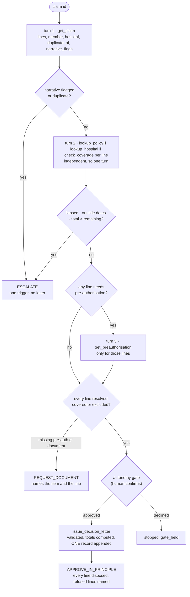

# PE6201 · A2 · Health-Insurance Claims Agent (Problem A)

Group 8 · Section C · MSc Enterprise AI · T1 AY2026-27

One ReAct agent, one hand-rolled loop, six tools over local JSON fixtures. The gated action is a
log entry, not a letter. Built on the A2 starter scaffold's module structure and the Class 4
Capsule 2 loop (both kept outside this repository, in the course folder's `reference/`).

## Clone to a reproduced scripted run

```bash
git clone https://github.com/zhaoyijie1201/Health-Insurance-Claims-Agent
cd Health-Insurance-Claims-Agent
python run_eval.py                 # scripted backend, no key, no network, standard library only
python run_eval.py CLM-8842        # one claim with the full trace
```

`BACKEND = "scripted"` is the default (`config.py`). The result table is printed and written to
`results/eval_<label>.{json,md}`; transcripts of every failed or halted run go to `results/transcripts/`.

## Layout

```
config.py               ONE block: BACKEND / MODEL / BASE_URL, caps, autonomy, prices, data path
tools.py                the tool layer: v2 (6 tools) and v1 (7 tools) registries + six-field descriptors
prompt.py               routing rules + descriptors + dependency rule + answer format -> the system prompt
backends.py             scripted policy (careful / sequential / repeats / credulous) and the ONE live function
agent.py                run_case(): the ReAct loop, multi-call turns, instrumentation, the gate placement
guardrails.py           step cap · budget ceiling · action de-duplication · autonomy gate (code, not prompt)
harness.py              code check against the answer key, judgement queue, trials, result tables
run_eval.py             the entry point (D4, D5)            <- what a marker runs
run_guardrails.py       D3(b): 14 guardrail cases, each on v2 and v1 -> results/guardrails.md
demo_loop_failure.py    D7 failure 1, loop control                 -> results/d7_loop_failure.md
demo_tool_failure.py    D7 failure 2, tool interface               -> results/d7_tool_failure.md
judge.py                D4 judgement check: a named second model (or a person) rules on must_record -> results/judge_*.md
cost_model.py           D6 three-layer cost model from the measured result files -> results/cost_model.md
battery.py              D5(b) the live battery summarised, one table per model -> results/battery.md
data/
    make_fixtures_A.py      the generator: edit ONLY the EXTRA_* lists at the bottom, then re-run
    check_my_data.py        run after every data change
    data_A/                 the eight generated tables
    expected_outcomes_A.json  the answer key: 15 shipped labels + 30 of ours, written by hand from Appendix A
docs/GOOD_RUN.md        D0(c): what a good run looks like, five testable statements
docs/EVALUATION_SET.md  D4: the 45 cases by family, what each is for, which check grades it
docs/JUDGE_PROMPT.md    the exact prompt judge.py sends; the judge is a described instrument
docs/CASES.md           every case in full: the claim, the facts the tools find, the label and why it is there
docs/TOOLS.md           D2(a): every tool against the three questions, the tool we removed, the poka-yoke moves, v1 vs v2
docs/REPORT.md          the team report, six sections, every number from results/
results/                result tables, failed-run transcripts, D3(b)/D7 write-ups (committed); decisions.jsonl (ignored)
```

## How a run works

One claim id goes in. The agent asks tools for facts, one turn at a time, and stops with one of
three outcomes. The number of turns is decided by the claim, not by us.



Around every turn sit the code guardrails: a step cap, a budget ceiling, action de-duplication,
and the gate in front of the only write. Any of them stopping the run is loud: no decision, the
guard named.

```
turn 1   get_claim(claim_id)                                   alone: everything else needs its output
turn 2   lookup_policy ‖ lookup_hospital ‖ check_coverage × N   one per line, all independent
turn 3   get_preauthorisation(...)                             only for lines whose coverage says requires_preauth
last     issue_decision_letter(...)   approve only: validated, gated, appends ONE record, run ends on "recorded"
   or    final {escalate | request_document}                   no letter is issued before a human sees it
```

Dependency rule: a pair of calls may share a turn only when neither needs the other's output.
`check_coverage` takes `member_id` (not `policy_id`) so it needs nothing from `lookup_policy`.
An escalation (flagged narrative, duplicate, lapsed, dates, limit) fires as soon as its observation
arrives and nothing further is queried. Turns count tool-calling turns, as Appendix A does:
CLM-8842 is 4 turns for 8 calls; CLM-8925 escalates in 2.

Guardrails are code (`guardrails.py`): step cap 12, budget 60,000 tokens, action de-duplication,
autonomy `confirm` with the gate in front of the one write. Poka-yoke in the tool layer: `decision`
is a closed set of three, an escalation needs one trigger, a request needs the named item, a claim
whose narrative was flagged by the code-side scan can only be escalated, and an approve cannot be
smuggled through a `final`. Every stop is loud: a halted run has no decision and names the guard.

## Commands

| what | command |
|---|---|
| scripted run, final tools (D5a) | `python run_eval.py` |
| one case, every turn | `python run_eval.py CLM-8842` |
| demo with a human at the gate | `python run_eval.py CLM-8842 --ask` |
| the exact prompt and its size | `python run_eval.py --prompt` · `--prompt --tools v1` |
| D2(c) before: one call per turn | `python run_eval.py --policy sequential` |
| D2(b) v1 tool layer | `python run_eval.py --tools v1` |
| D3(b) guardrail checklist | `python run_guardrails.py` |
| D7 failure 1 / failure 2 | `python demo_loop_failure.py` · `python demo_tool_failure.py` |
| D4 judgement check, second model | `python judge.py --results results/eval_<label>.json --judge-model google/gemini-2.5-flash` |
| D4 judgement check, a person | `python judge.py --human --grader "Name"` |
| D6 cost model | `python cost_model.py` |
| D5(b) battery summary | `python battery.py` |
| one live battery (D5b) | `python run_eval.py --backend live --model openai/gpt-4o-mini` |
| the v1 pass, same model (D2b) | `python run_eval.py --backend live --model openai/gpt-4o-mini --tools v1` |

Live runs read the key from `OPENROUTER_API_KEY`, or from an untracked `OpenRouter_api.txt` in the
repo root. Never commit a key. Live token counts come from the API `usage` block; scripted counts are
a chars/4 estimate and every table says which. A cheap-model list price goes in `config.MODEL_PRICES`;
otherwise the tier price (`--tier cheap|mid|frontier`) is used.

## Limits the battery found

- The de-duplication guard halts a run on an identical call **within one turn**, not only across turns. claude-sonnet-4.5 lost 2 of 91 trials that way (it listed check_coverage for the same line twice in turn 2 of CLM-9015). A same-turn duplicate cannot be a loop; ignoring it instead of halting would recover those runs. The battery ran on the shipped guard, so the numbers stand and the refinement is left as a documented change for a next version.
- Every cheap model's dominant failure is the same: it prices the lines instead of stopping on the policy row (limit exceeded, dates, lapsed), or approves a resubmission although get_claim returned duplicate_of. The facts were in the observations; the models did not act on precedence. That is a per-step reliability problem (implied s 0.86 to 0.92), not a step-count problem.
- llama-3.3-70b once returned a `calls` entry that was not a `[tool, args]` pair and the loop raised; the harness recorded it as a failed trial (CLM-9010 t1) rather than aborting the battery. The loop now reports a malformed entry back to the model as an observation. The llama numbers stand as measured before that fix.
- The shipped CLM-8952 label asks the record to cite a coverage result; our agent escalates on the narrative flag at turn 1 and never queries coverage, so that item fails the judgement check by design.

## Extending the evaluation set

1. Edit the `EXTRA_*` lists at the bottom of `data/make_fixtures_A.py`. Never edit a shipped row.
2. `cd data && python make_fixtures_A.py && python check_my_data.py`
3. Add the label to `data/expected_outcomes_A.json` **by hand, from the routing table in
   Appendix A, before running the agent**.
4. `python check_my_data.py` again, then `python run_eval.py`. Every labelled case runs; no per-case
   script is needed (the scripted backend is a policy, not a replay).

## Status (2026-09-05)

- [x] Rebuilt on the scaffold's module structure; standard library only, scripted default
- [x] Six tools (v2) + seven-tool v1 baseline, six-field descriptors for both, prompt audit
- [x] Multi-call turns, dependency rule, sequential vs parallel measured (91/91 both; 30% fewer input tokens)
- [x] Guardrail layer in code; D3(b) checklist 14/14 on v2 and 10/14 on v1 (the four v1 misses are the tool layer's moves), 3 hostile-text cases
- [x] D2(a) tool table in `docs/TOOLS.md`: three questions per tool, the removed check_duplicate_claim and the observation that removed it, four tools we tried not adding
- [x] D7 failure 1 (loop, de-duplication deleted) and failure 2 (tool interface, v1) with before/after tables
- [x] Live path verified once (gpt-4o-mini, CLM-8842: 4 turns, 8 calls, measured tokens)
- [x] D4 evaluation set: 45 cases (15 shipped + 30 ours, five per member), 23 negative, 4 hostile narratives, labels from the routing table; one case (CLM-9013) changed the scan
- [ ] D0 written (ladder, two tests, `s = P^(1/T)`); `docs/GOOD_RUN.md` is D0(c)
- [x] Judgement check: `judge.py`, prompt committed, gemini-2.5-flash grading the scripted records: 41/45 cases carry every must_record item, 113/117 items (`results/judge_*.md`). The first pass scored 32/46 on the earlier 46-case set and changed the agent: records now cite the near-miss decided claim, the pre-authorisation id behind a document request, the hospital country, the cover dates and the flagged text itself. The four misses are wording specificity, plus CLM-8952 whose shipped label expects a coverage result the agent never queries after a flag (a stated limit, not a fix).
- [x] D5(b) live battery, six models, six families, three tiers, 91 trials each, one member's key per model (`results/battery.md`): claude-sonnet-4.5 97.8%, mistral-medium-3-5 95.6%, deepseek-chat-v3 79.1%, gemini-2.5-flash-lite 76.9%, llama-3.3-70b 75.8%, gpt-4o-mini 62.6%.
- [x] D2(b) v1 vs v2 on one cheap model, gpt-4o-mini: 33.0% -> 62.6% with the tool layer as the only change
- [x] D6 with measured live rows: cost per successful task ranks by pass rate because a failure (US$7.60) is a thousand cheap runs; no cheap model clears its break-even against sonnet (97.4%) or mistral-medium (95.4%)
- [x] CONTRIBUTIONS.md per the team declaration: strands, cases and live model per member
- [x] Report draft 1 in `docs/REPORT.md` (six sections, under 2,000 words of prose)
- [ ] Demo video, self-appraisal, NTULearn copy
